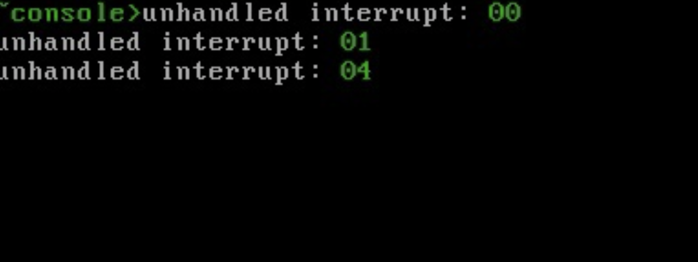
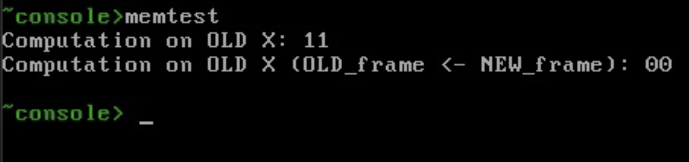
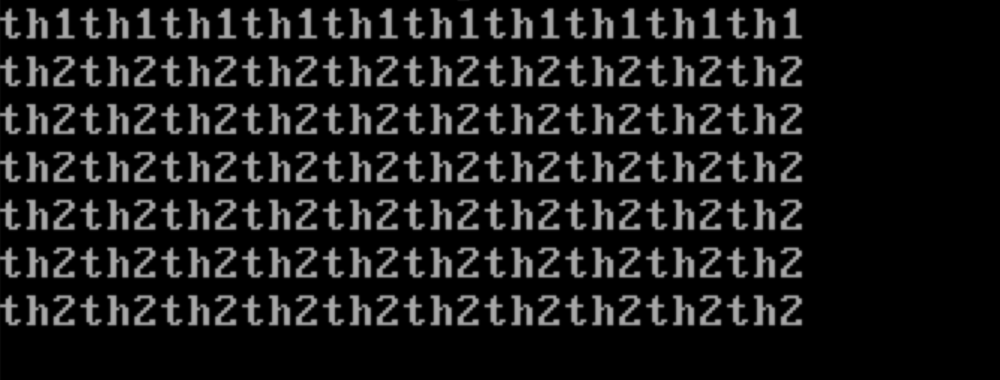
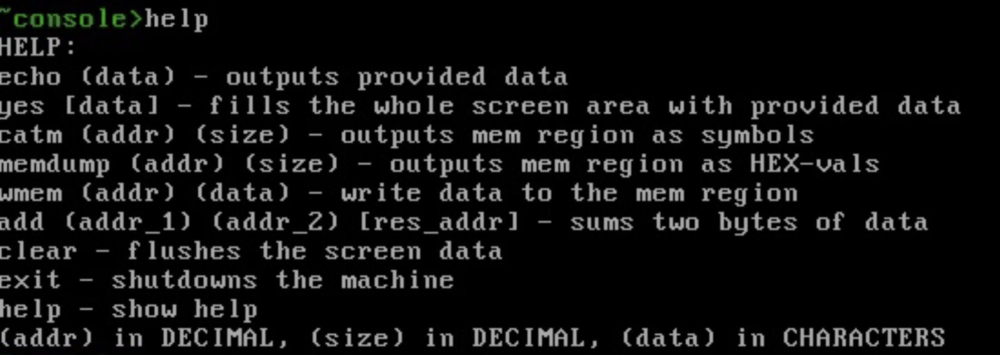

# MemOS

## Main objective

1. Make an example on how to implement basic Operating System with all key funtionality.

2. Write extensive guide on how to follow our steps and get a todd bit deeper understanding of operaing systems.

## Progress so far

1. basic bootloader (not used anymore) ✅

2. GNU-multiboot bootloader ✅

3. GDB-server connection ✅

3. basic work with video memory ✅

4. interrupts ✅



5. memory management ✅



6. threading ✅



7. basic shell ✅



8. userspace ⏰ (in progress)

9. guide ❌

## How to run

```shell
~> make deploy # compile OS

~> make run # run OS im emulated enviroment (QEMU)

~> make debug # run OS with GDB debug port open

~> make disk # compile and write an image which then can run on real machine (GRUB boot)
```